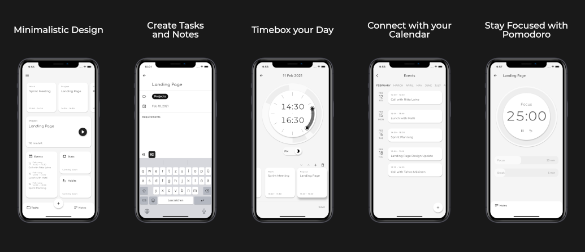

# Aikoa
A minimilastic productivity app that embraces the timeboxing method. We (Mathias Leppmeier and Jan Brunckhorst)
created this app to learn app development with Flutter.

If you want to read more about our learnings from building our first app as a side project, check out our Medium Article
[3 Lessons Learned From Building an App](https://medium.com/@jan.brunckhorst/lessons-learned-from-building-an-app-8c39f66a75d0).

    <a href="https://play.google.com/store/apps/details?id=com.betasonly.aikoa"></img></a>

    <a href="https://apps.apple.com/app/id1553344471"></img></a>

## Features
- Simple time boxing
- Pomodoro timer
- Easy task and notes management
- Calendar integration
- Minimalistic one page overview

## Authors
- Jan Brunckhorst (@neuencer)
- Mathias Leppmeier (@mleppmeier)

    <a href="https://www.buymeacoffee.com/betasonly"></img></a>

## Getting Started

This project is a starting point for a Flutter application.

A few resources to get you started if this is your first Flutter project:

- [Lab: Write your first Flutter app](https://flutter.io/docs/get-started/codelab)
- [Cookbook: Useful Flutter samples](https://flutter.io/docs/cookbook)

For help getting started with Flutter, view our 
[online documentation](https://flutter.io/docs), which offers tutorials, 
samples, guidance on mobile development, and a full API reference.